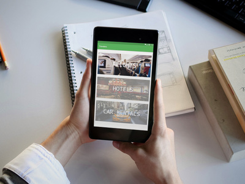

# Travelers
A booking application that allows users to book for flights, car rentals, and hotels.

Created by [Anthony njiru] (https://github.com/Tony-njiru ) With help of my school friends

## Features

- List the prices of flights from lowest to highest or vice versa
- Book for multiple people for the same flight
- Pay directly within the application
- Emails purchase verification once process has been complete

## Development Process

As a group, we often use slack to communicate our thoughts and ideas as well as having group meetings whether it be in person or on skype.

We developed the application within 3 iterations where in each iteration we prioritize the key features and distribute developer tasks among team members to create a minimum viable product.

For the structure of our application, we used a 3-tier architecture which includes business logic, presentation, and persistence (database).

## How to Run the Application
1. Requires Google Nexus 7 (1200 x 1920), Android 6.0.0, API 23
2. Select the App in Run/Debug Configuation
3. Wait for the build to finish then run the application
